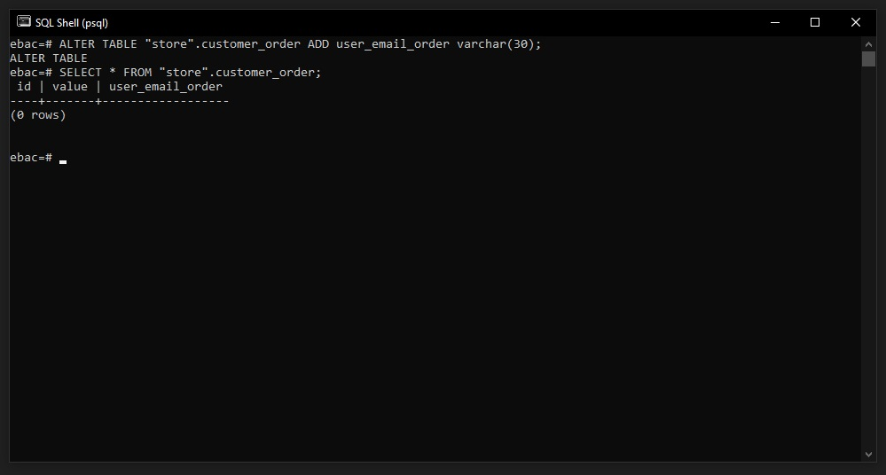

## ✅ Filtrando dados complexos utilizando subqueries

Podemos usar o WHERE `<campo>` IN passando uma lista de valores para filtrarmos:

```
SELECT * FROM "store".customer WHERE name IN ('Emerson Penelli', 'Maria');
```


<br>

Para nosso exemplo, vamos primeiro inserir uma coluna nova na tabela customer_order:

```
ALTER TABLE "store".customer_order ADD user_email_order varchar(30);
```



<br><hr>

Agora vamos inserir alguns dados na tabela customer_order:

```
INSERT INTO "store".customer_order (value, user_email_order) VALUES (30, 'maria@gmail.com');
```

<br><hr>

E agora podemos usar SELECTS dentro de outros SELECTS, note que para essa busca estamos utilizando o email da tabela customer para buscar dentro da tabela customer_order.

```
SELECT * FROM "store".customer_order WHERE user_email_order IN (
    SELECT email FROM "store".customer
);
```

<br>

### Resumo

Aprendemos um pouco como manipular dados de um banco de dados e quais são as principais funções do DML como:

- SELECT, INSERT, DELETE E UPDATE
- WHERE, IN
- SELECT dentro de outro SELECT
